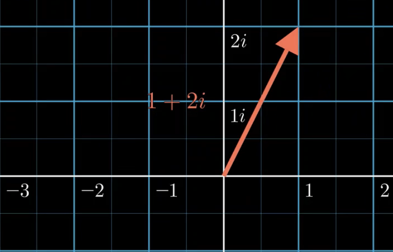
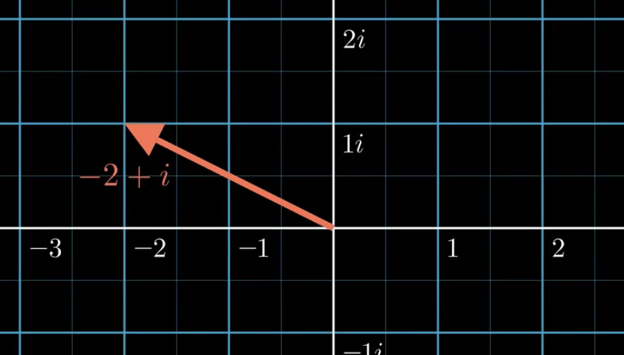

&emsp;
# 点和向量
## 1 点
三维空间中的点表示：$\pmb{p} = (\pmb{p}_x， \pmb{p}_y，\pmb{p}_z)$

&emsp;
## 2 向量
>向量
- $n$ 个有次序的数 $a_1，a_2，...，a_n$ 所组成的数组称为 $n$ 维向量，这 $n$ 个数称为该向量的 $n$ 个分量，第 $i$ 个数 $a_i$ 称为第 $i$ 个分量。

>范数（norm）
- $p$ 范数
    $$||\pmb{x}||_p = \sqrt[p]{|\pmb{x}_1|^p + ... + |\pmb{x}_n|^p}，p\geq 1$$
    - $l_1$ 范数（曼哈顿范数）：$p = 1，||x||_1=\sum\limits^n_{i=1}|x_i|$
    - $l_2$ 范数（模长，欧几里得范数）：$p =2，||x||_2=\sqrt{x^Tx} = \sqrt{\sum\limits^n_{i=1}x^2_j}$

>单位向量
- 模等于 1 的向量

>零向量
- 模等于零的向量

>实向量复向量
- 实向量：分量全为实数的向量
- 复向量：分量为复数的向量

&emsp;
## 1.1 向量的线性运算
>向量的加法

- 交换律：$\pmb{a}+ \pmb{b} = \pmb{b} + \pmb{a}$
- 结合律：$(\pmb{a} + \pmb{b}) + \pmb{c} = \pmb{a} + (\pmb{b} + \pmb{c})$

>向量的数乘
- 运算律
    - 结合律：$\lambda(\mu \pmb{a}) = \mu(\lambda \pmb{a}) = (\lambda\mu )\pmb{a}$
    - 分配率：
        - $(\lambda + \mu) \pmb{a} = \lambda\pmb{a} + \mu \pmb{a}$
        - $\lambda(\pmb{a} + \pmb{b}) = \lambda\pmb{a} + \lambda \pmb{b}$

&emsp;
## 1.2 向量组的线性相关性
>定义
- 给定向量组 $A: a_1, a_2, ..., a_m$，如果存在不全为零的数 $k_1, k_2, ..., k_m$，使
    $$k_1\pmb{a}_1+k_2\pmb{a}_2+...+k_m\pmb{a}_m = \pmb{0}$$
    则称向量组 $A$ 是线性相关的，否则则称它线性无关。

&emsp;
## 3 补充复数内容
### 3.1 定义
$z = x+yi$
- x：实部，记为 $x=Re\ z$
- y：虚部，记为 $y = lm\ z$

&emsp;
### 3.2 复数的运算
>加法运算

$z_1 \pm z_2 = (a_1 + b_1i) \pm (a_2 + b_2i) = (a_1 + a_2) \pm (b_1 + b_2)i$

    <image src="./imgs/复数-1.png" width = 300>

&emsp;

>乘法运算

$z_1  z_2 = (a_1 + b_1i)\ (a_2 + b_2i) = (a_1a_2 - b_1b_2) + (a_1a_2 + b_1b_2)i$

&emsp;
>除法

$\frac{z_1}{z_2} = \frac{a_1 + b_1i}{a_2 + b_2i} = \frac{(a_1 + b_1i)(a_2 - b_2i)}{a_2^2 - b_2^2} (a_2b_2 \neq 0)$

&emsp;
### 3.3 复数与旋转
>乘法与旋转
- 乘以 $i$ 相当于逆时针旋转 $90°$（$i^4$ 等于旋转 $360°$ 回到本身）

<table><tr>
    <td></td>
    <td></td>
</tr></table>
&emsp;

>任意角度旋转
- 欧拉公式：$e^{ix} = cos x + sin x\cdot i$
- 推导：
    

        <image src="./imgs/复数-4.png" width = 500>
    

    &emsp;

    

        <image src="./imgs/复数-6.png" width = 500>
    

    &emsp;